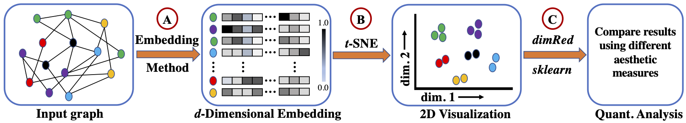

## Visualization of Labeled Graphs via High-Dimensional Embedding: Supervised vs. Unsupervised Approaches
We empirically show that the supervised graph embedding can generate better quality visualization than unsupervised methods. Different aesthetic measures support our prior statement.

## Run Different  Embedding Techniques
To generate embeddings for BatchLayout and GraphSAGE, go to corresponding folder and execute corresponding commands. Instructions are described in a README file. To generate embedding for DeepWalk and HARP download corresponding source codes and follow the instructions described in README files. We provide the embeddings generated by all tools inside the `embeddings` folder.

Parameters: For all tools, we generate 2 or 128-dimensional embeddings. All other parameters are dafault as mentioned in the corresponding tools. 

Download links of DeepWalk and HARP are given as follows:
[DeepWalk][https://github.com/phanein/deepwalk]
[HARP][https://github.com/GTmac/HARP]



## Generate 2D visualizations of embeddings
At first, make sure all required python packages are installed in the computer such as `scipy`, `scikit-learn`, `networkx`, `matplotlib`, `numpy`. To generate 2D visualization for a batchlayout embedding, please run the following command:
```
# python -u vismeasures.py datasets/cora.mtx 1 embeddings/cora_batchlayout_128.embd 128 datasets/cora.nodes.labels corabatchlayout
```
Here, first parameter is the input graph, second parameter is the type of embedding (1 for GraphSAGE/BatchLayout/DeepWalk, any other value for HARP), third parameter is the absolute path of embedding file, fourth parameter is the dimension of embedding, fifth parameter represents the ground truth labels for the vertices in input graph, then last parameter is the name of output visualization file.

To generate 2D visualization for a GraphSAGE embedding, please run the following command:
```
# python -u vismeasures.py datasets/cora.mtx 1 embeddings/cora_graphsage_128.embd 128 datasets/cora.labels.pg coragraphsage
```
For HARP, use the following command:
```
# python -u vismeasures.py datasets/cora.mtx 2 embeddings/cora_harp_128.npy 128 datasets/cora.nodes.labels coraharp
```
Note that GraphSAGE has different input format and datasets are downloaded from a website. So, we provide its ground truth labels with a different file with a ".pg" suffix in the name, e.g., cora.labels.pg file contains ground truth labels for cora dataset. For other tools, ground truth labels are in cora.nodes.labels file.

## Find the value of aesthetic measures
When we generate 2D visualization, it also reports silhouette and Davies-Bouldin measures. To get Q<sub>local</sub> and Q<sub>global</sub> measures, users need to have following R packages: `knitr`, `Rtsne`, `coRanking`,and `dimRed`. Then, go inside `qmeasures` folder and run the following:
```
Rscript test.R
```


### Contact 
If you have questions, please don't hesitate to ask me (Md. Khaledur Rahman) by sending email to `morahma@iu.edu` or `khaled.cse.07@gmail.com`.
